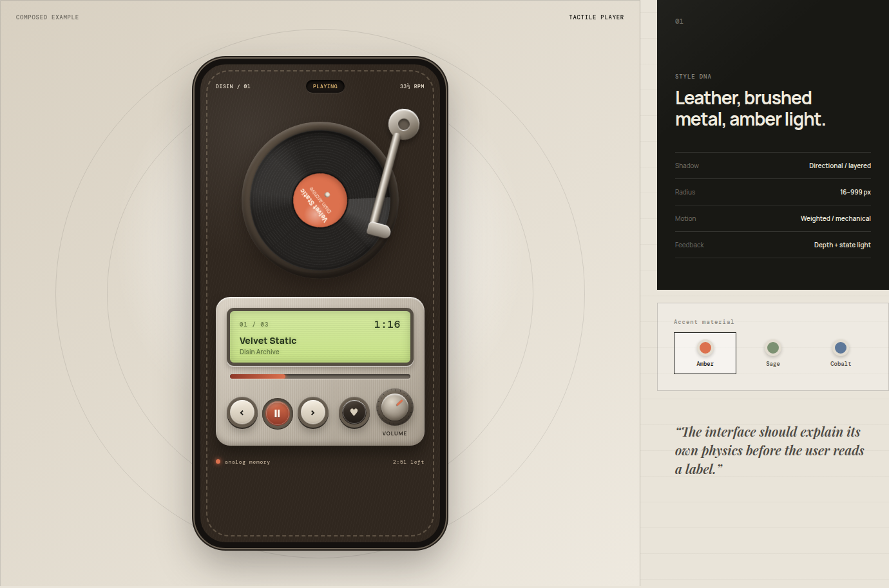

<div align="center">


# Disin

**A living archive of interface styles, design tokens, and tactile components.**

一个持续生长的界面设计档案：保存设计语言、可复用组件、原始参考稿与在线交互 Demo。

[Live gallery](https://disin.vercel.app) · [Skeuomorphic notes](./designs/skeuomorphic/README.md) · [Original HTML reference](https://disin.vercel.app/references/tactile-player.html)

</div>



## The collection · 设计集合

| Style | Status | Includes |
| --- | --- | --- |
| **Skeuomorphic · 拟物化** | Active | Tactile buttons, rotary knob, LCD panel, vinyl record, tonearm and a complete music-player composition |
| More styles | Planned | Each future style gets isolated tokens, components, notes and references |

## Repository shape · 仓库结构

```text
src/
├── designs/
│   ├── registry.ts
│   └── skeuomorphic/
│       ├── components.tsx
│       ├── player.tsx
│       └── tokens.css
├── app.tsx
└── styles.css
designs/
└── skeuomorphic/README.md
public/
└── references/tactile-player.html
```

The gallery is the product surface; `src/designs/` contains reusable,
framework-level implementations; `designs/` records the visual decisions; and
`public/references/` preserves source artifacts without making them production
dependencies.

展示站用于浏览和交互；`src/designs/` 沉淀可复用实现；`designs/` 记录设计规则；
`public/references/` 原样保存参考文件，避免业务代码与历史稿耦合。

## Develop

```bash
npm install
npm run dev
```

```bash
npm run typecheck
npm run build
```

## Add another style

1. Add an entry to `src/designs/registry.ts`.
2. Create `src/designs/<style>/` with isolated tokens and components.
3. Add a short decision record under `designs/<style>/`.
4. Add one real composition—not only disconnected swatches.

---

<p align="center">
  <sub>Designed to be inspected · Built to be reused</sub>
</p>
