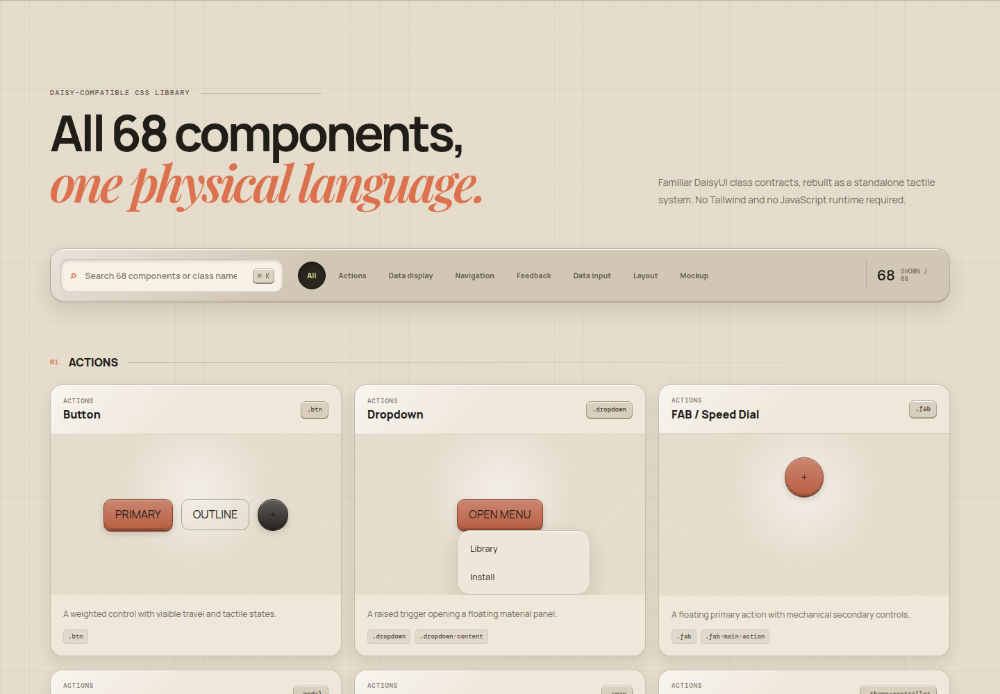
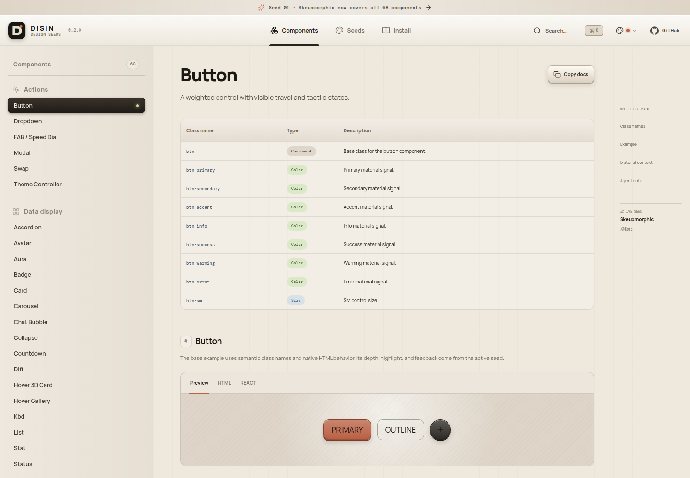
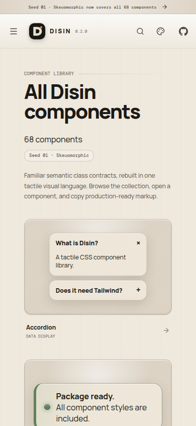

<div align="center">


# Disin

**Design-seed CSS components for people and coding agents.**

一套可直接安装的拟物化 CSS 组件库：兼容熟悉的 DaisyUI 类名，同时提供
Agent Skill、机器可读组件清单和完整在线预览。

[Component docs](https://disin.vercel.app/components/) · [Seed 01](https://disin.vercel.app/seeds/skeuomorphic/) · [Agent Skill](./skills/disin/SKILL.md) · [Design notes](./designs/skeuomorphic/README.md)

</div>

| Component index | Component detail |
| --- | --- |
|  |  |

<p align="center">
  
</p>

## Why Disin?

Most component libraries optimize for flat neutrality. Disin gives controls an
understandable physical language: buttons travel, inputs recess, status lights
glow, and surfaces explain hierarchy through material.

Disin implements the complete **68-component DaisyUI 5.7.4 catalog** as an
independent, framework-agnostic CSS package. It uses compatible class contracts
such as `btn`, `card`, `modal`, `input`, `toggle`, and `mockup-phone`, but does
not require DaisyUI, Tailwind CSS, React, or a JavaScript runtime.

多数 UI 库追求扁平和中性。Disin 则用深度、材质和机械反馈表达状态，并将
DaisyUI 当前 68 个组件的类名契约重新实现为统一的拟物化设计。

> Disin is an independent project inspired by the public
> [DaisyUI component catalog](https://daisyui.com/components/). It is not
> affiliated with or endorsed by DaisyUI.

## Install · 安装

```bash
npm install disin
```

```css
/* global.css */
@import "disin/styles.css"; /* all 68 components */
```

```html
<html data-theme="disin" data-seed="skeuomorphic">
  <button class="btn btn-primary">Save changes</button>
</html>
```

Disin is CSS-first, so the same markup works in React, Vue, Svelte, Astro,
Next.js, Nuxt, Rails, Django, static HTML, and other web stacks.

Or import only the components a page uses:

```css
@import "disin/tokens.css";
@import "disin/components/button.css";
@import "disin/components/card.css";
@import "disin/components/input.css";
```

If the npm registry is unavailable, install directly from GitHub:

```bash
npm install github:ishuowang/disin
```

## Install for AI agents · 面向 AI 安装

Disin includes a portable Agent Skill compatible with Codex, Claude Code,
Cursor, and other [Agent Skills](https://github.com/vercel-labs/skills)
clients:

```bash
npx skills add ishuowang/disin --skill disin -y
```

The skill tells an agent how to detect the project stack, install the package,
choose semantic components, preserve native accessibility, and validate the
result.

Machine-readable entry points:

| Entry | Purpose |
| --- | --- |
| [`skills/disin/SKILL.md`](./skills/disin/SKILL.md) | Complete agent workflow |
| [`llms.txt`](https://disin.vercel.app/llms.txt) | Compact model context |
| `disin/components.json` | 68 definitions, class names, and individual CSS paths |
| `disin/ai.json` | npm, pnpm, Yarn, Bun, GitHub and Skill install recipes |

Agent prompt:

```text
Install the Disin skill from ishuowang/disin, then use Disin components to
build this interface. Keep native semantics and validate it at 390px.
```

## Component coverage · 组件覆盖

| Family | Count | Components |
| --- | ---: | --- |
| Actions | 6 | Button, Dropdown, FAB, Modal, Swap, Theme Controller |
| Data display | 19 | Accordion, Avatar, Aura, Badge, Card, Carousel, Chat, Collapse, Countdown, Diff, Hover 3D, Hover Gallery, Kbd, List, Stat, Status, Table, Text Rotate, Timeline |
| Navigation | 9 | Breadcrumbs, Dock, Link, Megamenu, Menu, Navbar, Pagination, Steps, Tabs |
| Feedback | 7 | Alert, Loading, Progress, Radial Progress, Skeleton, Toast, Tooltip |
| Data input | 15 | Calendar, Checkbox, Fieldset, File Input, Filter, Label, Radio, Range, Rating, Select, Input, Textarea, Toggle, Validator, OTP |
| Layout | 8 | Divider, Drawer, Footer, Hero, Indicator, Join, Mask, Stack |
| Mockup | 4 | Browser, Code, Phone, Window |
| **Total** | **68** | Complete DaisyUI 5.7.4 catalog baseline |

Search and interact with every component in the
[live documentation](https://disin.vercel.app/components/).

## Compose with familiar classes

```html
<article class="card">
  <div class="card-body">
    <span class="badge badge-primary">Ready</span>
    <h2 class="card-title">Tactile console</h2>

    <label class="input input-primary">
      <input placeholder="Station name" />
    </label>

    <div class="card-actions">
      <button class="btn">Cancel</button>
      <button class="btn btn-primary">Save</button>
    </div>
  </div>
</article>
```

Semantic color modifiers include `primary`, `secondary`, `accent`, `neutral`,
`info`, `success`, `warning`, and `error`. Common component sizes are `xs`,
`sm`, `md`, `lg`, and `xl`.

## Package architecture · 包结构

```text
src/
├── library/
│   ├── components.ts          # typed 68-component manifest
│   ├── index.ts               # package entry
│   ├── styles.css             # complete CSS entry
│   └── styles/
│       ├── tokens.css
│       ├── actions.css
│       ├── data-display.css
│       ├── navigation.css
│       ├── feedback.css
│       ├── data-input.css
│       ├── layout.css
│       └── mockup.css
├── catalog/                   # 68 reusable live demos
├── docs/                      # documentation shell and component pages
└── seeds/
    ├── registry.ts            # active and planned visual languages
    └── skeuomorphic/          # Seed 01 implementation and composition
skills/disin/SKILL.md          # portable Agent Skill
llms.txt                       # compact AI context
package-dist/                  # generated npm package
```

The CSS family files are independently maintainable, while `styles.css`
provides a single import for consumers. `npm run build:package` produces a small
ES module, the complete stylesheet, shared tokens, **68 individual component
stylesheets**, and generated JSON manifests.

## Develop and verify

```bash
npm install
npm run dev
```

```bash
npm run typecheck
npm run build
npm run test:package
```

## Design principles

1. **Depth communicates state.** Pressed controls move inward.
2. **Material follows hierarchy.** Metal operates; leather contains; light reports.
3. **Native semantics stay intact.** Styling never replaces button, input,
   dialog, details, progress, or table behavior.
4. **Motion needs a physical reason.** Reduced-motion preferences are respected.
5. **Agents use contracts, not guesswork.** Every component and install path is
   machine-readable.

## Add another design seed

Disin is a broader design archive organized as seeds. Future visual languages
live under `src/seeds/<seed>/`; the current installable package is Seed 01,
Skeuomorphic.

1. Add the seed to `src/seeds/registry.ts`.
2. Implement it under `src/seeds/<seed>/` and keep its tokens scoped.
3. Add a real composition plus isolated component specimens.
4. Record decisions under `designs/<style>/`.

---

<p align="center">
  <sub>Designed to be inspected · Built to be reused · Documented for agents</sub>
</p>
